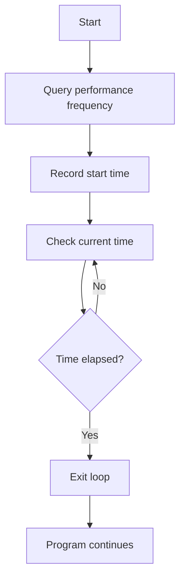

# PhantomDelay

## 🧳 Overview

The `PhantomDelay` function provides a way to introduce a precise delay in your program, measured in seconds. It's useful when you need your program to wait for a specific amount of time without using common functions like `Sleep`, which might not offer as precise control.
This function uses the high-resolution performance counter provided by Windows (`QueryPerformanceCounter`) to measure time, making it more accurate than typical timer functions.

## ⚙️ How It Works

1. **High-Resolution Timer**: It uses the `QueryPerformanceCounter` function, which retrieves the current value of the high-resolution performance counter. This counter provides precise time measurements, making the delay highly accurate.
2. **Frequency**: It uses the `QueryPerformanceFrequency` function to determine the frequency of the performance counter, which allows it to calculate the exact number of counts needed for the specified number of seconds.
3. **Looping until Time Elapsed**: The function enters a loop that keeps checking the counter until the specified time has passed. Once the desired time is reached, the loop ends, and the program continues.

## 📝 How to Use

### 1. Include the Header

To use the `PhantomDelay` function in your code, you need to include the `phantom_delay.h` header file.

```cpp
#include "phantom_delay.h"
```

### 2. Call the Function

Call the `PhantomDelay` function and pass the number of seconds you want the program to wait.

Example:
```cpp
#include "phantom_delay.h"

int main() {
    stealth::PhantomDelay(5);
    return 0;
}
```

## 🗺️ Flow Diagram



## 🌟 Key Benefits

- **High Precision**: The delay is accurate because it uses a high-resolution performance counter.
- **Simple and Fast**: The function is lightweight and easy to implement in any project.

## 📜 License

This project is licensed under the MIT License.
